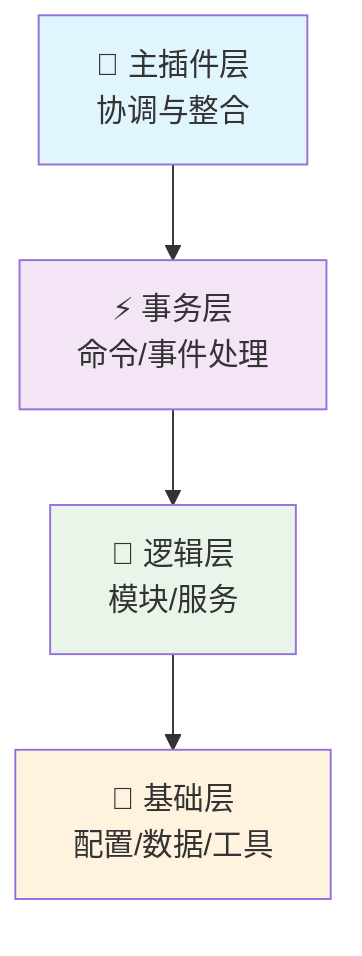

<div align="center">

[](https://newnan.city)

# 🎮 NewNan Plugins Monorepo

[](LICENSE)
[](https://adoptium.net/)
[](https://kotlinlang.org/)
[](https://papermc.io/)
[](https://gradle.org/)

[](https://github.com/NewNanCity/Plugins)
[](https://github.com/NewNanCity/Plugins)
[](https://github.com/NewNanCity/Plugins/issues)

**🚀 让你的 Minecraft 服务器拥抱现代化与工程化！**

本仓库是一个采用 **Kotlin + Gradle** 的多模块插件生态系统，面向 **Paper 1.20.1**，
提供统一的核心框架与一组高质量、可组合的插件与功能模块。

---

</div>

## ✨ 亮点特性

> 🏗️ **现代化架构**
> BasePlugin + BaseModule + Terminable 自动资源管理，严谨的生命周期绑定

> ⚡ **高性能与可维护性**
> 四层单向依赖结构，高内聚低耦合，避免内存/资源泄漏

> 🛠️ **统一开发体验**
> 多模块共享版本管理与构建约定（Convention Plugin + Shadow 打包 + RunPaper）

> 🎯 **一体化能力**
> 配置（Jackson 多格式）、国际化（i18n + MiniMessage）、GUI 框架、任务调度器（ITaskHandler）

> 📝 **命令系统**
> 基于 Cloud 2.x 注解驱动命令，深度集成 i18n 与 Adventure

> 🚀 **生产可用**
> 支持 JDK21 编译、JDK17 运行时兼容；Paper API 1.20.1；禁用阻塞式用法的最佳实践

<div align="center">

### 🔧 环境与兼容

| 环境            | 版本要求     | 说明       |
| --------------- | ------------ | ---------- |
| 🏗️ **构建/开发** | JDK 21       | Toolchain  |
| ⚙️ **运行兼容**  | Java 17+     | 目标字节码 |
| 🖥️ **服务器**    | Paper 1.20.1 | 推荐版本   |

</div>

---

## 📁 仓库结构总览

```
📦 NewNan-Plugins
├── 🏛️ core/              # 核心框架与基础设施
├── 🧩 modules/           # 可选功能模块
├── 🔌 plugins/           # 独立插件项目
├── 📚 docs/              # 完整的框架与模块文档中心
└── 🔧 buildSrc/          # 统一的版本与依赖管理
```

| 目录       | 说明                                       |
| ---------- | ------------------------------------------ |
| `core`     | 生命周期、调度器、事件、消息、缓存、工具等 |
| `modules`  | config、gui、i18n、network                 |
| `plugins`  | tpa、railarea、feefly、external-book 等    |
| `docs`     | 完整的框架与模块文档中心                   |
| `buildSrc` | 统一的版本与依赖管理、构建约定插件         |

> 📋 详情参见 [`project-tree.md`](project-tree.md)

---

## 🧩 模块 Modules（按需依赖）

<div align="center">

| 模块          | 功能描述               | 状态   |
| ------------- | ---------------------- | ------ |
| 🔧 **config**  | Jackson 多格式配置支持 | ✅ 稳定 |
| 🖥️ **gui**     | 现代 GUI 系统          | ✅ 稳定 |
| 🌐 **i18n**    | 多语言模板系统         | ✅ 稳定 |
| 🌐 **network** | Ktor 客户端工具        | ✅ 稳定 |

</div>

### 📦 详细特性

- **🔧 config**: Jackson 多格式配置（YAML/TOML/JSON/XML/Properties/HOCON）、类型安全解析、缓存与合并（touchWithMerge）
- **🖥️ gui**: 现代 GUI 系统（Session/Page/Component），原生 i18n 集成，20+ 容器与 8 类组件，异步渲染与自动资源释放
- **🌐 i18n**: 多语言模板系统（MiniMessage/Legacy 自动识别），统一 LanguageKeys 规范，printf/sprintf API
- **🌐 network**: Ktor 客户端工具、可终止网络请求、链式任务处理

> 📖 文档入口：[`docs/README.md`](docs/README.md)

---

## 🔌 插件 Plugins（精选）

<div align="center">

### 🌟 特色插件

| 插件                | 描述                   | 状态       |
| ------------------- | ---------------------- | ---------- |
| 📚 **external-book** | 外部书籍管理与发布     | ✅ 生产就绪 |
| 🏗️ **foundation**    | 基础设施与经济系统集成 | ✅ 生产就绪 |
| 🚄 **railarea**      | 铁路区域/站点机制      | ✅ 生产就绪 |
| 📦 **rail-express**  | 铁路物流/快递玩法      | ✅ 生产就绪 |
| ⏰ **mcron**         | 基于 Cron 的调度系统   | ✅ 生产就绪 |
| 🚀 **tpa**           | 玩家传送请求           | ✅ 生产就绪 |
| ✈️ **feefly**        | 付费飞行系统           | ✅ 生产就绪 |
| 💀 **deathcost**     | 死亡经济惩罚           | ✅ 生产就绪 |

</div>

### 📋 完整插件列表

<details>
<summary>🔍 点击展开查看所有插件</summary>

- 📚 **external-book**: 外部书籍管理与发布，现代 GUI、权限与缓存，i18n 完整支持
- 🏗️ **foundation**: 基础设施与经济系统集成（含 XConomy 监听集成）
- 🚄 **railarea**: 铁路区域/站点机制（仅加载已加载世界，动态管理；空间检测优化）
- 📦 **rail-express**: 铁路物流/快递玩法
- ⏰ **mcron**: 基于 Cron 的调度系统
- 🚀 **tpa**: 玩家传送请求
- ✈️ **feefly**: 付费飞行（定时扣费、事件可扩展）
- 💀 **deathcost**: 死亡经济惩罚（最佳配置实践示例）
- 🎛️ **better-command-block**: 增强命令方块功能
- 🔧 **mc-patch**: Minecraft 修补工具
- ⚡ **powertools**: 强力工具集
- 🏗️ **createarea**: 区域创建管理
- 🛡️ **guardian**: 安全守护系统
- 🏙️ **newnanmain**: 主城管理
- 💰 **dynamiceconomy**: 动态经济系统

</details>

> 📋 完整清单以 [`settings.gradle.kts`](settings.gradle.kts) 与 [`project-tree.md`](project-tree.md) 为准

---

## 🏗️ 架构与最佳实践

<div align="center">

### 📐 四层单向依赖架构



</div>

### 🎯 核心设计原则

> 🧩 **BaseModule 规范**
> 子类须在 init 块内显式调用 init()；onInit 做最小初始化，onReload 负责配置加载

> 🔄 **资源与任务管理**
> 事件、调度器、协程均绑定到 BasePlugin 或 BaseModule 自动释放；推荐使用非阻塞式 ITaskHandler API

> ⚙️ **配置管理模式**
> configManager.touchWithMerge + parse 模式在 getPluginConfig() 内执行；reload 时先 clearCache 与重建语言管理器

> 📝 **命令系统集成**
> Cloud 注解 + 统一错误处理 + i18n 描述映射；所有插件在 plugin.yml 中正确声明依赖

> 🖥️ **GUI 生命周期**
> 会话栈、组件生命周期随页面自动回收；禁止非存储组件被玩家拖拽修改

> 📖 延伸阅读：[`docs/core/best-practices.md`](docs/core/best-practices.md)

---

## 🚀 构建与运行

### 📋 前置要求

> ☕ **安装 JDK 21**
> 仓库使用 Gradle Wrapper（无需本地安装 Gradle）

### 🛠️ 构建命令

<div align="center">

| 操作                 | 命令                                         | 说明                |
| -------------------- | -------------------------------------------- | ------------------- |
| 🏗️ **构建所有插件**   | `./gradlew buildAllPlugins`                  | 包含 shadowJar      |
| 📦 **打包所有插件**   | `./gradlew shadowJarAll`                     | 仅打包 shadowJar    |
| 🔧 **构建单个插件**   | `./gradlew :plugins:external-book:build`     | 示例：external-book |
| 📦 **打包单个插件**   | `./gradlew :plugins:external-book:shadowJar` | 示例：external-book |
| 🖥️ **启动测试服务器** | `./gradlew :plugins:external-book:runServer` | 示例：external-book |

</div>

### 📁 输出产物

构建产物位置：各插件子项目的 `build/libs/` 目录下（-all/-shadow 变体按配置）

### 🚀 部署运行

1. 将目标插件的 JAR 文件放入服务端 `plugins/` 目录
2. 确保服务器运行在 **Java 17+** 环境
3. 确保服务器为 **Paper 1.20.1** 版本

---

## 🚀 快速开始（开发者）

<div align="center">

### 🛣️ 开发流程


</div>

### 📋 详细步骤

1. **📝 项目注册**
   在 [`settings.gradle.kts`](settings.gradle.kts) 注册新插件子项目

2. **🏗️ 创建结构**
   新建插件目录与 `build.gradle.kts`，应用约定插件（`newnancity-plugin`）

3. **🧩 继承框架**
   主类继承 `BasePlugin`，并实现 `reloadPlugin()`

4. **⚙️ 配置模块**
   以 `BaseModule` 方式拆分业务（子模块在 `onPluginEnable` 初始化、在 `onReload` 加载配置）

5. **📦 引入依赖**
   按需引入 modules（config/i18n/gui/network）并遵循 i18n 与消息规范

6. **📝 实现命令**
   命令采用 Cloud 注解风格，注册于 `CommandRegistry`（模块化实现）

7. **📚 参考示例**
   使用 [`docs/`](docs/) 与 [`plugins/external-book/`](plugins/external-book/) 作为最佳实践参考

---

## 📚 文档与资源

<div align="center">

### 📖 文档导航

| 类别               | 链接                                             | 描述                             |
| ------------------ | ------------------------------------------------ | -------------------------------- |
| 🏠 **文档中心**     | [`docs/README.md`](docs/README.md)               | 总览与导航                       |
| 🏛️ **Core 框架**    | [`docs/core/README.md`](docs/core/README.md)     | BasePlugin、BaseModule、调度器等 |
| 🖥️ **GUI 模块**     | [`modules/gui/README.md`](modules/gui/README.md) | GUI 系统文档                     |
|                    | [`docs/gui/`](docs/gui/)                         | 详细指南与示例                   |
| ⚙️ **配置与国际化** | [`docs/config/`](docs/config/)                   | 配置管理                         |
|                    | [`docs/i18n/`](docs/i18n/)                       | 国际化支持                       |
| 🔧 **故障排查**     | [`docs/troubleshooting/`](docs/troubleshooting/) | 常见问题与解决方案               |

</div>

---

## 🤝 贡献指南

<div align="center">

### 💡 贡献原则

</div>

> 📝 **代码风格**
> 遵循 Kotlin 官方代码风格与本仓库约定（版本统一于 [`buildSrc/Versions.kt`](buildSrc/Versions.kt)）

> 🏗️ **架构原则**
> 坚持模块化与开闭原则，禁用阻塞调用，优先非阻塞任务链（getNow/thenRun…）

> 🆕 **新功能**
> 新功能优先放入独立模块或插件；文档与示例随代码一并提交

> ✅ **质量保证**
> 提交前请在本地构建通过；必要时补充/更新 docs 与示例

<div align="center">

### 🔄 贡献流程

```mermaid
gitgraph
    commit id: "Fork"
    branch feature
    checkout feature
    commit id: "开发"
    commit id: "测试"
    commit id: "文档"
    checkout main
    merge feature
    commit id: "合并"
```

</div>

---

## 🙏 致谢与鸣谢

<div align="center">

### �️ 特别鸣谢

> 🧪 **NSrank**
> 感谢 NSrank 提供认真细致的测试工作，为项目质量保障做出了重要贡献

> 🤖 **AI 编码助手团队**
> 感谢 Claude、GPT、Kimi 和 Deepseek 团队所提供的 AI 编码与智能体工具
> 为本项目的开发节省了大量的时间和精力

---

### �🌟 感谢开源生态

[](https://papermc.io/)
[](https://docs.adventure.kyori.net/)
[](https://github.com/Incendo/cloud)
[](https://ktor.io/)
[](https://github.com/FasterXML/jackson)

---

### 💝 如果你也追求工程化与可维护性的 Minecraft 插件开发

<div align="center">

[](https://github.com/NewNanCity/Plugins)
[](https://github.com/NewNanCity/Plugins)
[](https://github.com/NewNanCity/Plugins/contribute)

**⭐ Star & 🍴 Fork & 🤝 贡献！**

</div>

</div>
